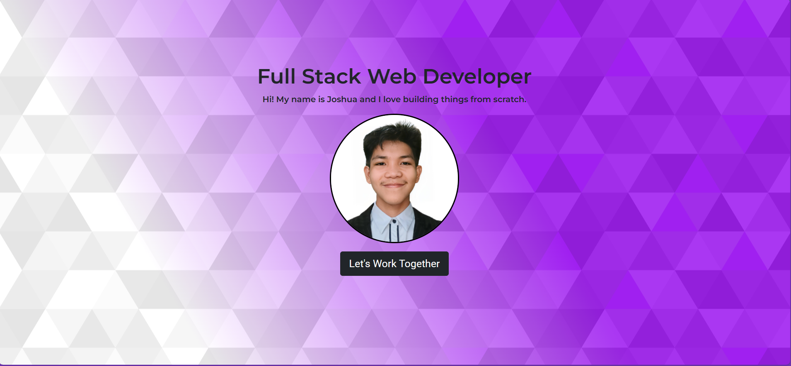

<h1>Basic Personal Portfolio</h1>

<h2>A simple project in Zuitt - Coding Bootcamp's Free Coding Bootcamp: Basic Web Development Workshop</h2>

    This simple project leveraged the use of HTML, CSS, and Bootstrap to create a visually appealing About landing page.

    

